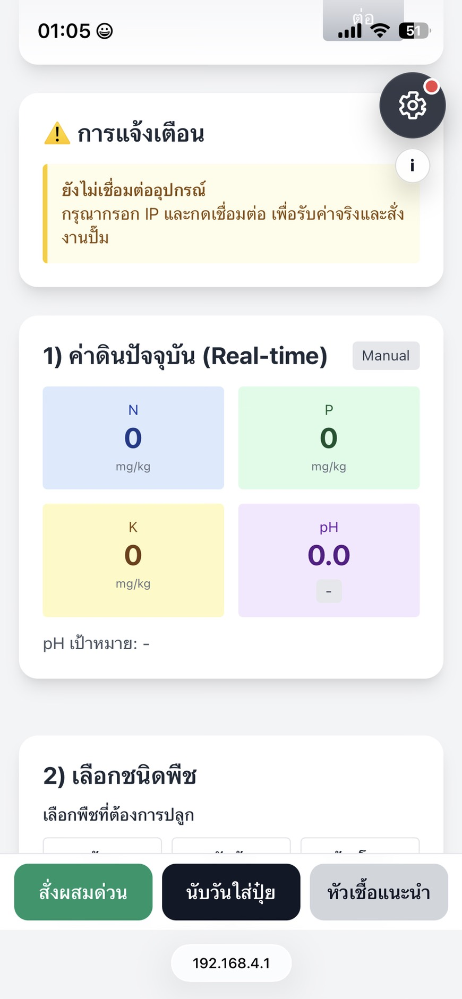
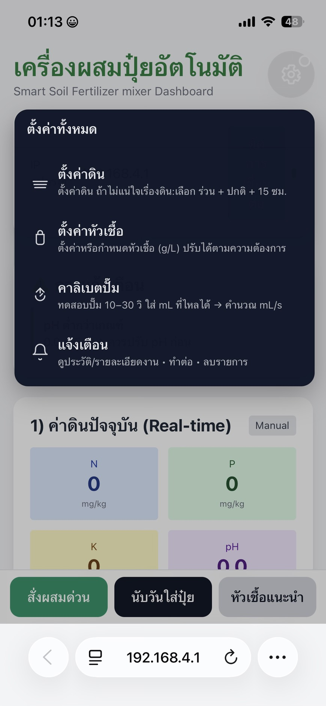
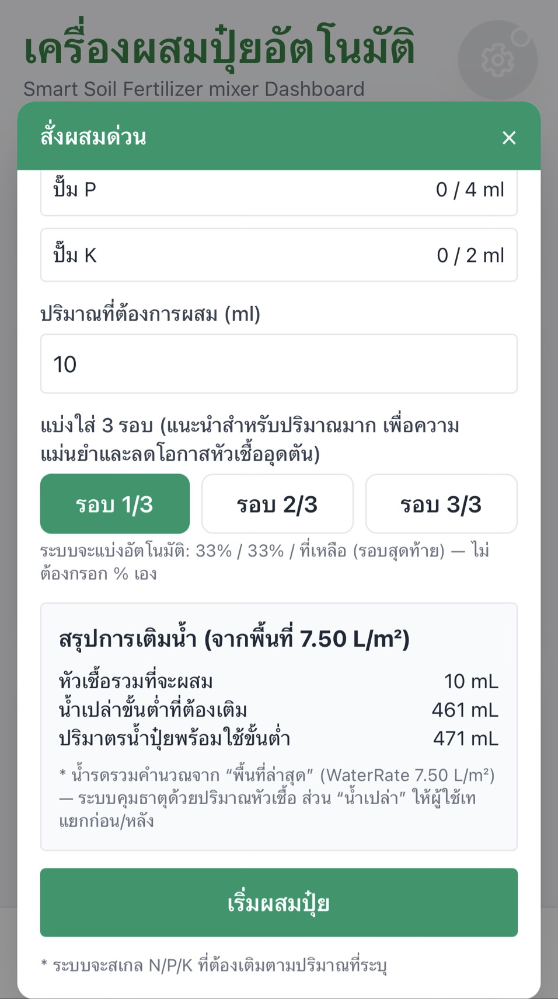
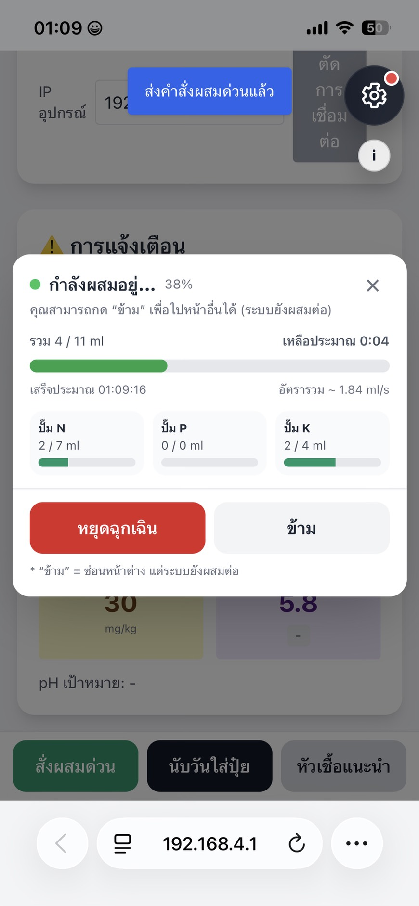
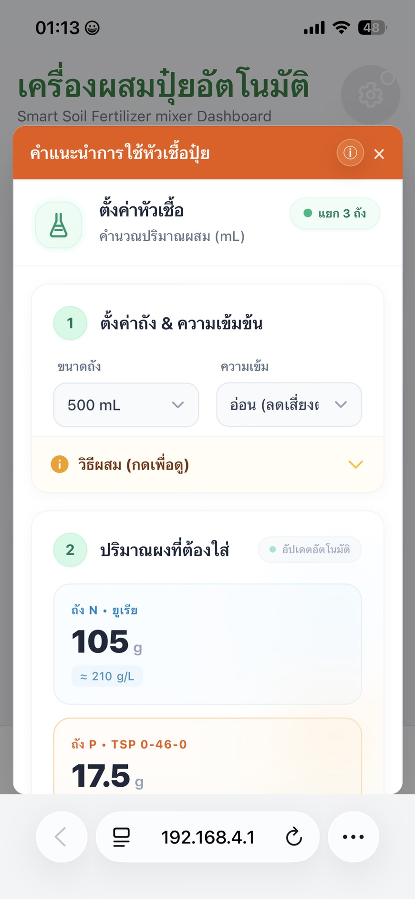

# Smart Fertilizer Mixer & Soil Analyzer (ESP32 + Dashboard)

## Overview
ระบบ IoT ที่อ่านค่าดิน (N/P/K, pH) และแนะนำสูตร/ปริมาณปุ๋ยตามชนิดพืช พร้อมหน้าเว็บ Dashboard สำหรับแสดงผลแบบ real-time และสถานะการทำงาน
## Live Demo (GitHub Pages)
https://tanai5688.github.io/smart-fertilizer-mixer/

## Key Features
- อ่านค่า NPK และ pH จากเซนเซอร์
- แสดงผลแบบ real-time บน Dashboard
- แนะนำสูตร/ปริมาณปุ๋ยตามชนิดพืช
- แสดงสถานะการทำงาน/แจ้งเตือนเพื่อช่วยลดความผิดพลาดของผู้ใช้

## Tech Stack
ESP32, Arduino, Sensors, Wi-Fi/HTTP, HTML/CSS/JavaScript, JSON

## Workflow
1) Read sensor data → 2) Send to dashboard → 3) Process & evaluate → 4) Recommend → 5) Display status/result
## Quick Start
1. Power on ESP32 device and connect to its Wi-Fi (AP) or local network.
2. Open the dashboard in a browser (e.g., http://192.168.4.1).
3. Verify real-time readings (N/P/K/pH) or use Manual mode.
4. Select plant type → get fertilizer recommendation.
5. Run Quick Mix / Mixing and monitor progress + safety stop.
## Repository Structure
- `esp32/` : ESP32 firmware source
- `web/`   : Dashboard (HTML/CSS/JS)
- `images/`: Screenshots

## My Contribution
- ออกแบบ workflow และ state ของระบบ
- พัฒนา logic ฝั่ง ESP32 และการส่งข้อมูล
- พัฒนา/ปรับปรุง UI Dashboard และการแสดงสถานะ
- ทดสอบและปรับให้เหมาะกับการใช้งานจริง/สาธิต
## Screenshots

